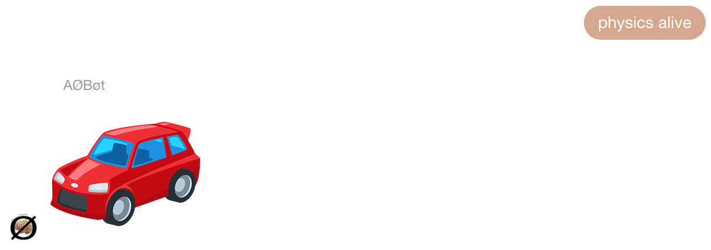

# AssumeZero Bot

## About
AssumeZero Bot is a highly configurable bot that can be added to Facebook Messenger group chats. It is designed to expose features that may be hidden or made difficult to use by Messenger's UI, both on desktop and mobile. In addition to this functionality, it also connects to several different external services, like [Spotify](https://spotify.com), [Wolfram|Alpha](http://wolframalpha.com), and [OpenWeatherMap](https://openweathermap.org).

The bot was written with [Node.js](https://nodejs.org/) and the incredible [Facebook Chat API](https://github.com/Schmavery/facebook-chat-api), which allows the bot to emulate a Facebook user who can be added and removed from chats. As of this writing, Facebook's [official API](https://developers.facebook.com/docs/chat) can still only be used in one-on-one conversations.

## Usage
Most of the bot's features are activated with a "trigger word," which can be changed in [`config.js`](config.js). The default trigger word is "physics" and most commands will be in the form:

> physics command [options]

To see a list of commands, use:

> physics help

## Basic Commands
As a rule of thumb, the bot is capable of doing everything that a human user can do on the desktop version of Messenger. This includes messaging the chat, adding and removing users, and modifying user nicknames. Let's take a look:

However, being a bot comes with its own set of advantages. For example, the bot can remove a user for a certain period of time before adding them back automatically!

Because the bot interfaces directly with Facebook's endpoints through the Facebook Chat API, it often has access to an expanded set of abilities that are not directly available through Messenger's UI.

It can set the chat color to any hexidecimal value rather than just those provided by the default palette; similarly, it can set the chat emoji to any emoji that Messenger itself supports.

